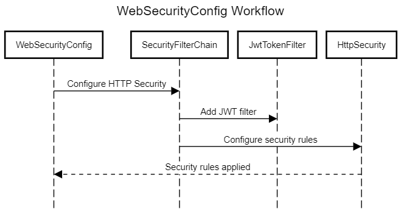
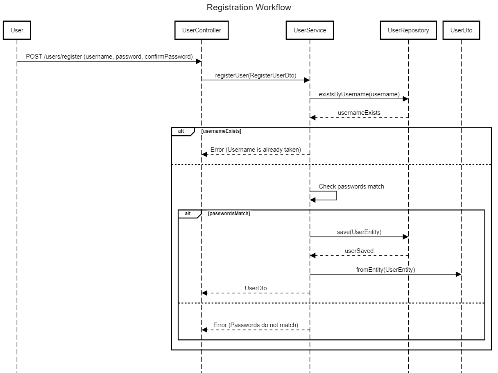
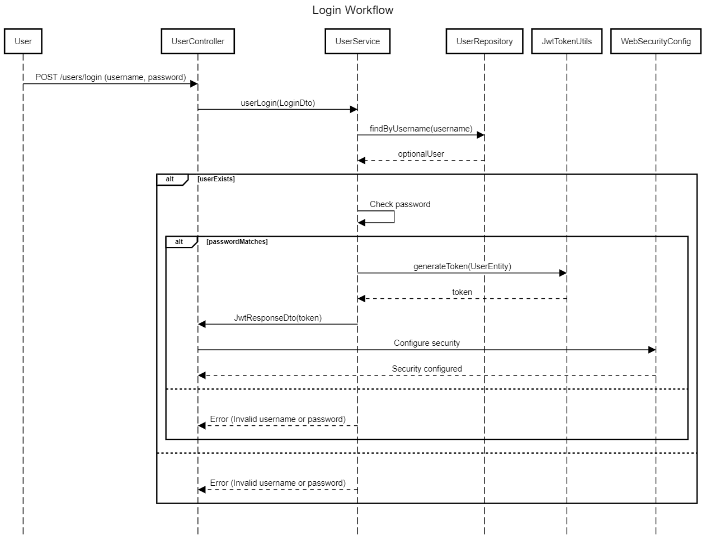
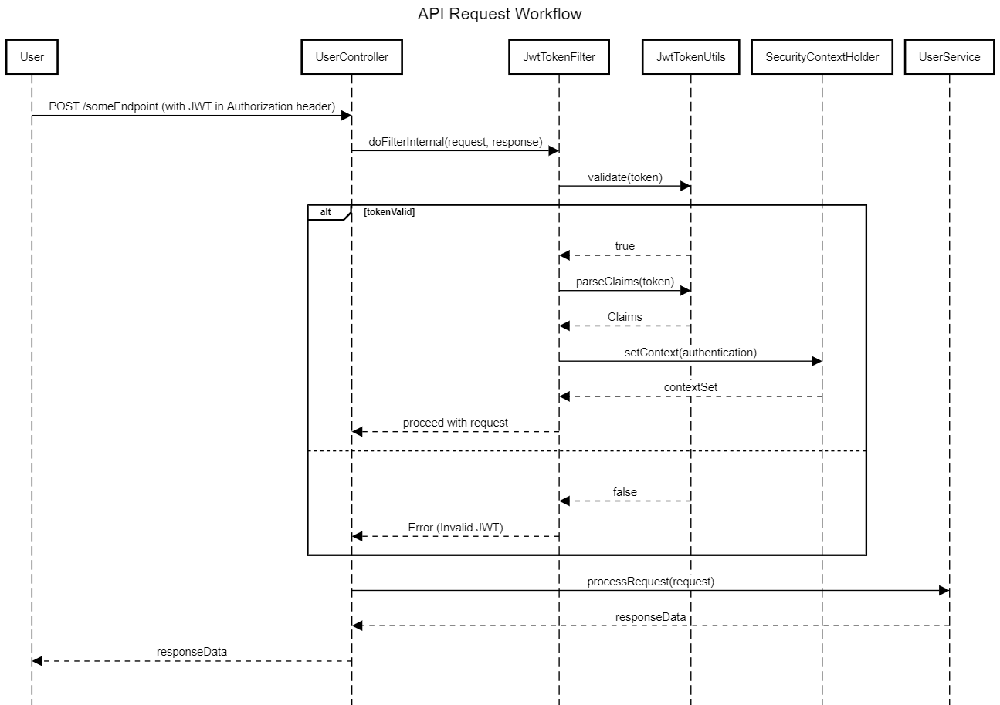
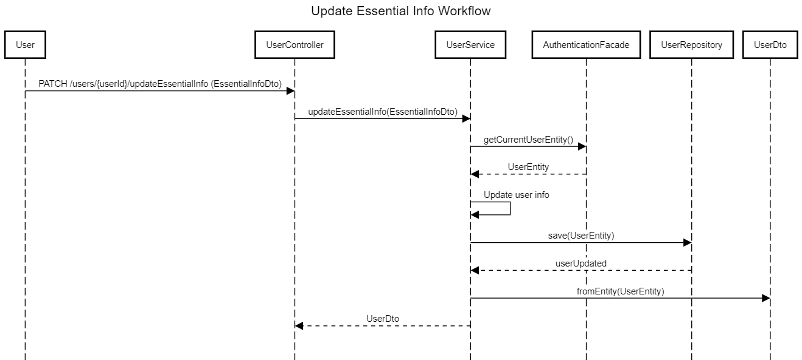
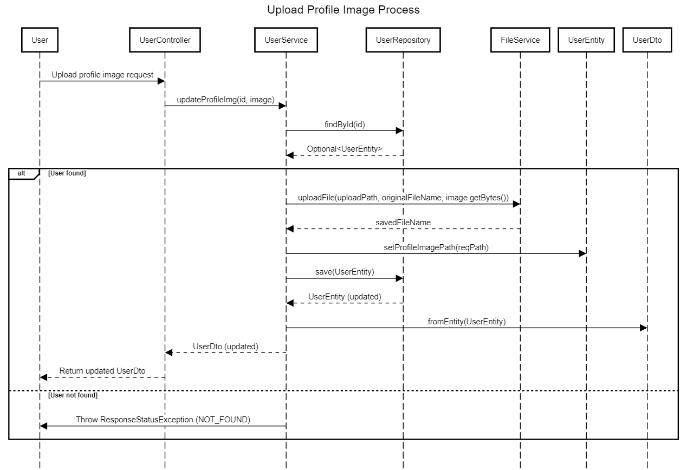
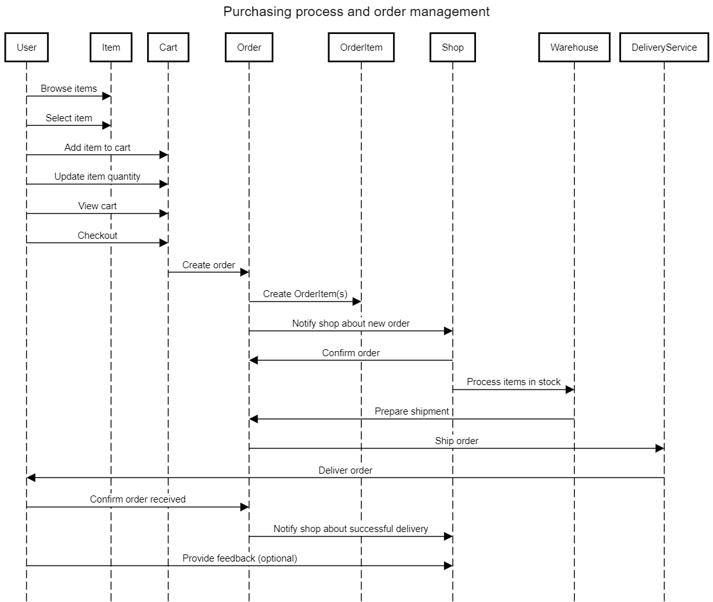

# Workflow Diagram
## Web Security Workflow

## User Registration and Login Workflow
### User Registration Workflow

### User Login Workflow

## API Request Workflow

### Update essential info workflow

### Update Profile Image Workflow

## Purchasing Process And Order Management

## Logic of cart and order management
1. Add to Cart:
   - Customer adds items.
   - System updates or creates the cart.
   
2. Place Order
    - Customer places the order. 
    - System processes the order and clears the cart.
   
3. Order Management 
   - View Orders: Get a list of orders for the shop. 
   - View Specific Order: See details of a particular order. 
   - Confirm Order: Mark the order as confirmed. 
   - Cancel Order: Cancel the order if it's pending.

